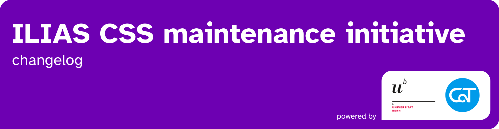

This repository documents all **css changes and their impact** as well as the status of **ongoing design projects** done by the CSS Maintenance Initiative powered by the [University of Bern](https://www.unibe.ch/) and [Concepts and Training GmbH](https://concepts-and-training.de/).

> [!IMPORTANT]
> If improved UX and UI in ILIAS are important to you, please consider supporting our initiative with funding or by regularily investing work hours. Anyone who joins us will get regular shout outs on reports and any activity carried by the initiative.

To get in contact, join the conversation and get updates, visit the **CSS Squad channel** on the [ILIAS Discord Server](https://discord.gg/H9v2v2Ar2T).

If you want to contribute, our general [guidelines for SCSS development](https://github.com/ILIAS-eLearning/ILIAS/blob/release_10/templates/Guidelines_SCSS-Coding.md) are a good place to start learning our best practices. To build your own skins for ILIAS, look at the [Custom System Style Guide](https://github.com/ILIAS-eLearning/ILIAS/blob/release_10/templates/Readme.md). Be aware that there are fundamental differences in structure between ILIAS version 8, 9 and 10.

Thriving open-source communities must welcome community work, not hinder it!
