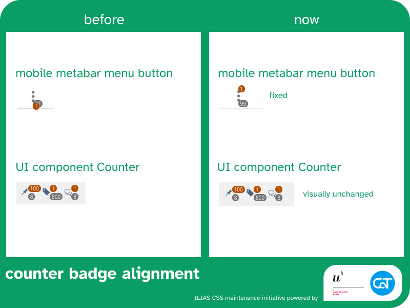

The following changes are made possible with resources from the [University of Bern](https://www.unibe.ch/) and [Concepts and Training GmbH](https://concepts-and-training.de/).

> [!IMPORTANT]
> If improved UX and UI in ILIAS are important to you, please consider supporting our initiative with funding or by regularily investing work hours. Anyone who joins us will get regular shout outs on reports and any activity carried by the initiative.

# Week 5 of July

## Inactive Buttons in Dropdown

`medium impact` `UI framework` `mental model`

[→ Mantis Issue](https://mantis.ilias.de/view.php?id=45480) [→ PR ILIAS 10](https://github.com/ILIAS-eLearning/ILIAS/pull/9922)

### Issue

Buttons with unavailable actions inside a UI component dropdown look exactly like buttons with available actions. This violates user expectations because they expect the action to be available.

### Changes

UI Component Dropdown

* Fix: Using the disabled background color for the entire menu item
* Fix: As all other unavailable buttons, cursor symbol is now set to "not-allowed"
* Maintenance: Code structure tweaks to stretch buttons across menu
* Maintenance: Ensure buttons and links in dropdowns have the same height

### Impact

* for system styles: check in Kitchen Sink if your skin visibly marks unavailable actions in Dropdowns

### Outlook

We should consider adding a menu tool/pattern to derive drodpown, drilldown, tree,... buttons from.

---

## Misaligned badges on mobile menu glyph

`medium impact` `UI framework` `broken design` `readability`

[→ Mantis Issue](https://mantis.ilias.de/view.php?id=43828) [→ PR ILIAS 10](https://github.com/ILIAS-eLearning/ILIAS/pull/9923)

### Issue

Notification badge counters overlapped on the menu button inside the metabar on mobile views. This looks broken and makes one badge unreadable.

### Changes

UI Component Dropdown

* Implementation Concept: The UI Component structurally carrying the badge now directly works as the anchor for it.

### Impact

* for delos: potentially anything using badges could show slight side effects. Kitchen Sink examples remain unchanged, but only tests the now deprecated glyph links with badges.

### Outlook

* As Glyphs with links/actions are now deprecated, we should implement badges on buttons. The CSS side should already be done with this PR.
* It appears that legacy components use the class `.badge` from this UI component. We should consider separating the two and always style with `.c-component { &__element {} }` to avoid effects leaking out of the UI component.
