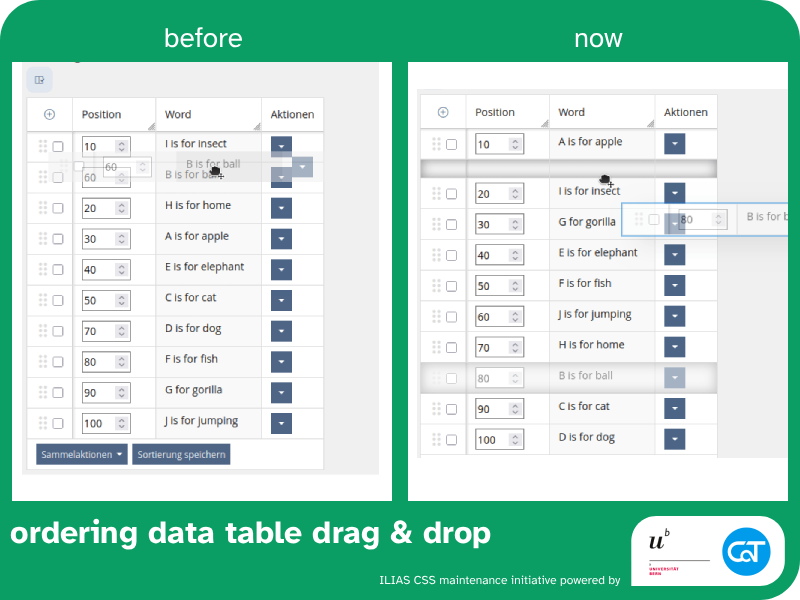
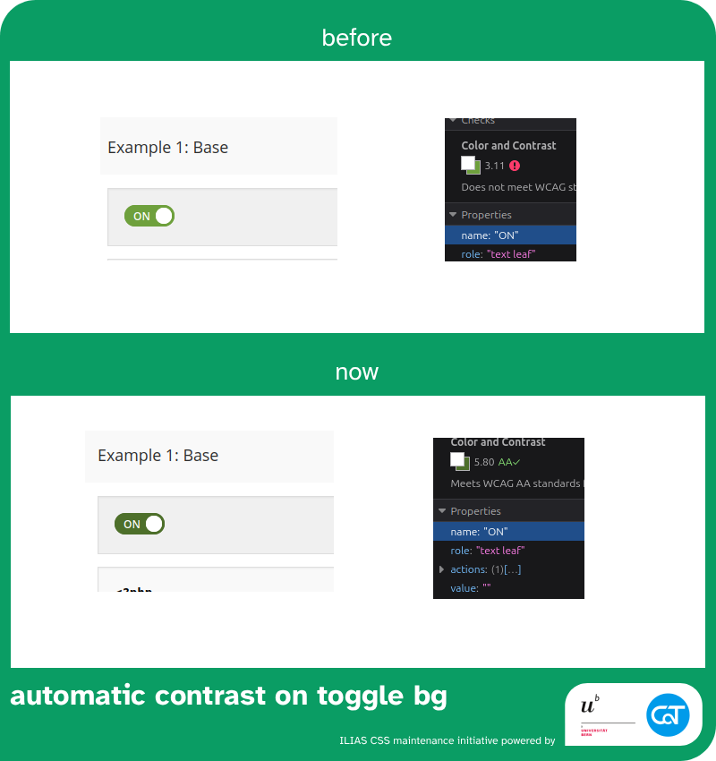
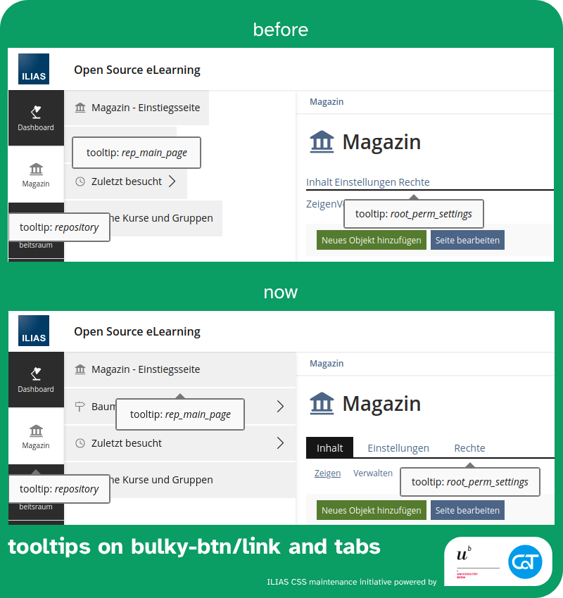

The following changes are made possible with resources from the [University of Bern](https://www.unibe.ch/) and [Concepts and Training GmbH](https://concepts-and-training.de/).

> [!IMPORTANT]
> If improved UX and UI in ILIAS are important to you, please consider supporting our initiative with funding or by regularily investing work hours. Anyone who joins us will get regular shout outs on reports and any activity carried by the initiative.

# September 2025

## Readability of system infos 45167 

`small impact` `UI framework` `readability`

[→ Mantis Issue](https://mantis.ilias.de/view.php?id=45167) [→ PR](https://github.com/ILIAS-eLearning/ILIAS/pull/10098)

### Issue

* when system infos have dark backgrounds, the text, links, close button are not readable
* the color contrast tool seems to not be working in this context

### Changes

* There was an issue with the SCSS contrast tool that is supposed to switch the text to white not being loaded correctly - it's actually weird that this compiled at all.
* added a restyling of links to guarantee visibility on dark backgrounds

I think this section is now a good example of how to flip text color to white depending on the background.

### Larger Scope

* Currently, we use the main-bg color everywhere when we need white in delos, but there might be cases where we need to differentiate between main-bg color and the most/least contrasting text color. It might be smarter to work with variables like $color-no-contrast-to-main-bg and $color-most-contrast-to-main-bg. We should discuss this during a CSS Squad Meeting.

---

## No Rendering of pagination component (parts) without functionality

`small impact` `UI framework` `visual improvement`

[→ Mantis Issue](https://mantis.ilias.de/view.php?id=45536) [→ PR ILIAS 10](https://github.com/ILIAS-eLearning/ILIAS/pull/10099)

### Issue

Pagination component (parts) without functionality are disabled. They are not needed though and therefore shouldn't get rendered at all.

### Changes

UI Component (Input) ViewControl Pagination

* Fix: No rendering of disabled pagination components (left and right rocker)
* Fix: No rendering of pagination if only one page would be rendered

---

## Better Ordering Table Drag & Drop 44136

`medium impact` `UI framework` `readability` `touch input` `drag & drop`

[→ Mantis Issue](https://mantis.ilias.de/view.php?id=44136) [→ PR](https://github.com/ILIAS-eLearning/ILIAS/pull/9114)

### Issue

Drag and drop of ordering table doesn't work at all on touchscreens and in Webkit/Safari desktop.

### Changes

* added a whole list of event listeners reproducing drag and drop on mobile
* mobile doesn't scroll when reaching the edges of the screen, added detection and scroll behavior manually.
* modifying the browser default desktop drag and drop behaviour so that Webkit/Safari is working. It still adds its own twist when drag and drop is stopping with a flyback animation that is not fitting, but I didn't look further into it for now.
* added settle animation to make UI jump more pleasant
* stopped row hovering during drag because it miscommunicates the drag position
* @yvseiler provided me with some helpful best practices of how the drag and drop could be even more user friendly:
    * add a ghostly double at the position where the item is dragged from
    * visualized position where the item would be dropped as a gap in the table
    * added a drag image to the finger position on touch, desktop behavior is mostly default browser behavior with minor tweaks so Safari cooperates.
* settle animation uses CSS event to remove animation class

---

## Toggle Component: Fix color contrast for ON state

`small impact` `UI framework` `accessibility`

[→ Mantis Issue](https://mantis.ilias.de/view.php?id=45424) [→ PR](https://github.com/ILIAS-eLearning/ILIAS/pull/10178)

### Issue

Background fill for toggle ON status is too light. It doesn't provide sufficient contrast for the white text.
toggle_low-contrast-color

### Change

Now forcing a lightness value of 30 using Sass color.change hsl value replacement. This might be a good approach to force a contrast in other places as well.
toggle_accessible-color

### Impact

However, some clients of service providers do not like brand colors to be altered in this way, so we might want to introduce dedicated contrast color variables that brands could fill deliberately.

---

## Fix broken tooltips for bulky buttons and tabs

[→ Mantis Issue](https://mantis.ilias.de/view.php?id=42421) [→ PR](https://github.com/ILIAS-eLearning/ILIAS/pull/10213)

### Issue

Attaching KS UI Tooltips to legacy elements breaks the design.

### Changes

Following designs have been fixed to work with the additional container that the KS UI Tooltip requires:

* in slate
    * bulky-btn
    * bulky-link
* in mainbar
    * bulky-btn
    * bulky-link
* Tabs
* Sub-Tabs

### Outlook

Tabs and Sub-Tabs need to become UI components. Support for tooltips could then be a fully thought through feature and not a band-aid.
Bulky concept has to be refined and more examples have to be added to the Kitchen Sink so testing is easier and the limits and recommendations can be communicated more clearly.
