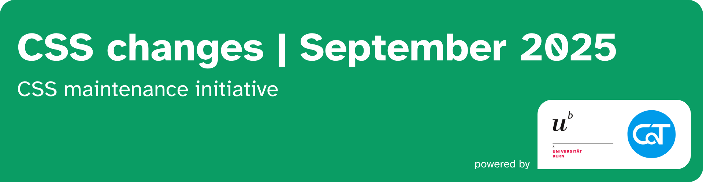
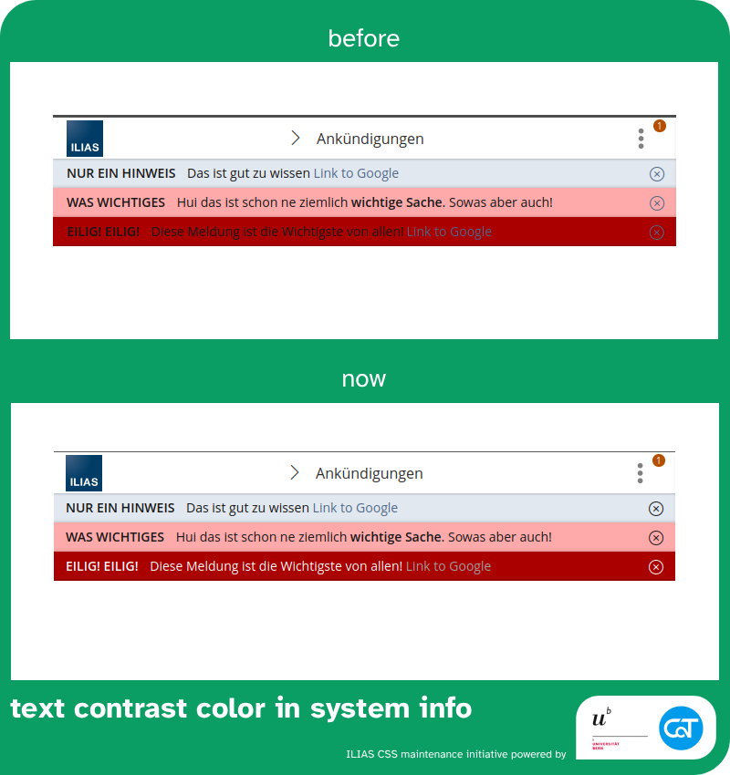
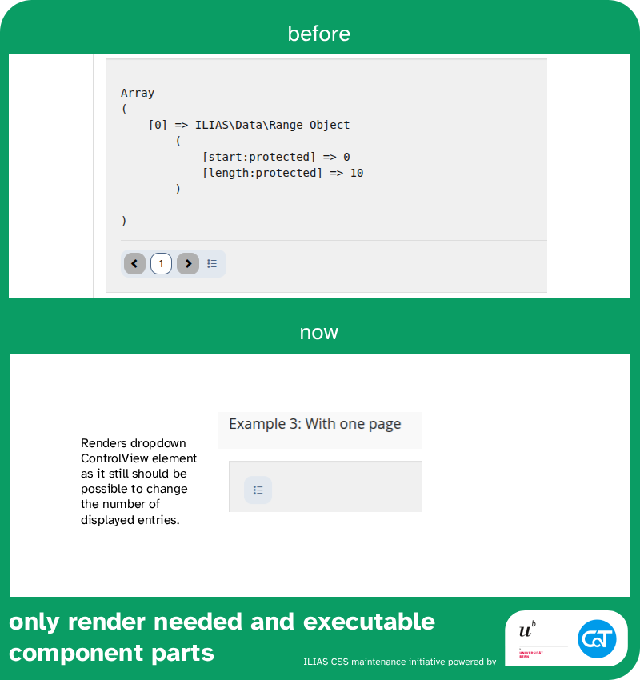
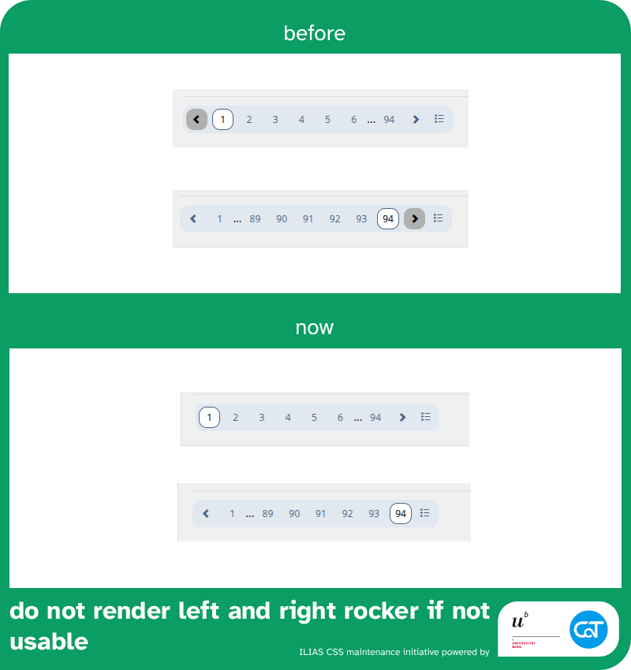

The following changes are made possible with resources from the [University of Bern](https://www.unibe.ch/) and [Concepts and Training GmbH](https://concepts-and-training.de/).

> [!IMPORTANT]
> If improved UX and UI in ILIAS are important to you, please consider supporting our initiative with funding or by regularily investing work hours. Anyone who joins us will get regular shout outs on reports and any activity carried by the initiative.

# September 2025

## Readability of system infos 45167 

`small impact` `UI framework` `readability`

[→ Mantis Issue](https://mantis.ilias.de/view.php?id=45167) [→ PR](https://github.com/ILIAS-eLearning/ILIAS/pull/10098)

### Issue

* when system infos have dark backgrounds, the text, links, close button are not readable
* the color contrast tool seems to not be working in this context

### Changes

* There was an issue with the SCSS contrast tool that is supposed to switch the text to white not being loaded correctly - it's actually weird that this compiled at all.
* added a restyling of links to guarantee visibility on dark backgrounds

I think this section is now a good example of how to flip text color to white depending on the background.

### Larger Scope

* Currently, we use the main-bg color everywhere when we need white in delos, but there might be cases where we need to differentiate between main-bg color and the most/least contrasting text color. It might be smarter to work with variables like $color-no-contrast-to-main-bg and $color-most-contrast-to-main-bg. We should discuss this during a CSS Squad Meeting.

---

## No Rendering of pagination component (parts) without functionality

`small impact` `UI framework` `visual improvement`

[→ Mantis Issue](https://mantis.ilias.de/view.php?id=45536) [→ PR ILIAS 10](https://github.com/ILIAS-eLearning/ILIAS/pull/10099)

### Issue

Pagination component (parts) without functionality are disabled. They are not needed though and therefore shouldn't get rendered at all.

### Changes

UI Component (Input) ViewControl Pagination

* Fix: No rendering of disabled pagination components (left and right rocker)
* Fix: No rendering of pagination if only one page would be rendered