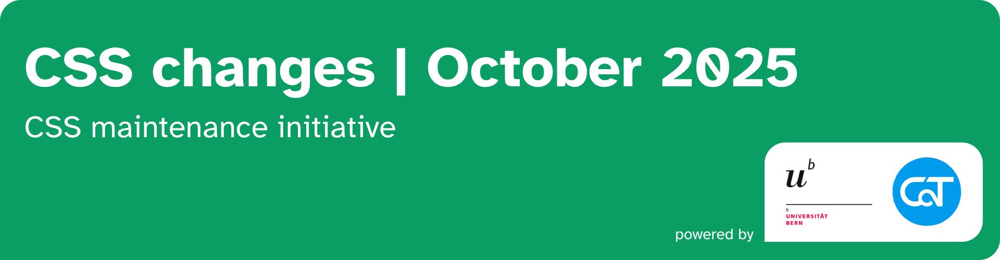
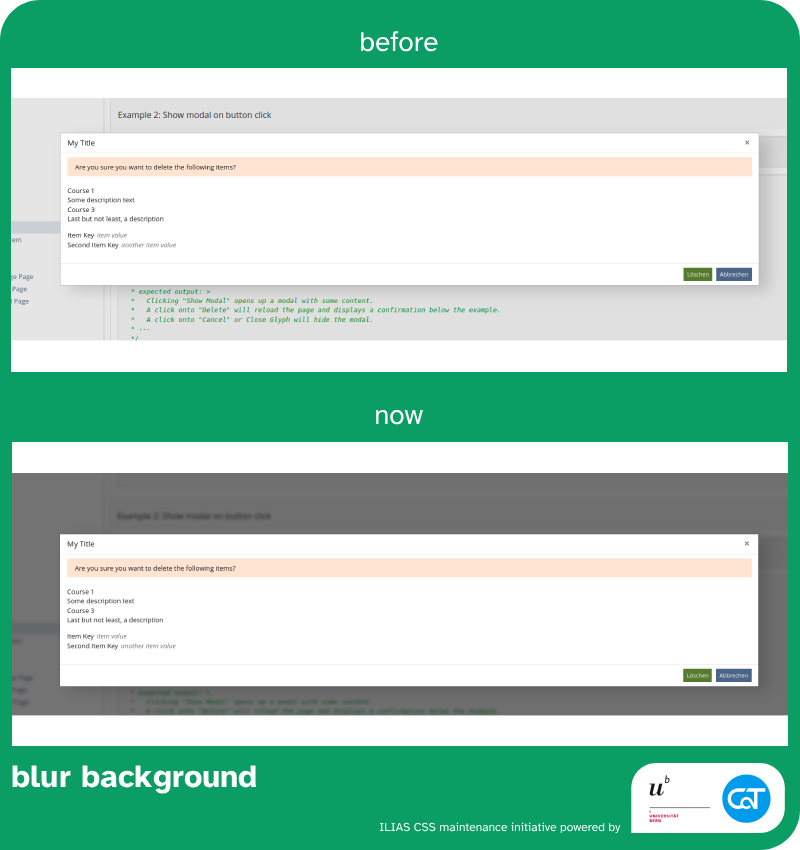

The following changes are made possible with resources from the [University of Bern](https://www.unibe.ch/) and [Concepts and Training GmbH](https://concepts-and-training.de/).

> [!IMPORTANT]
> If improved UX and UI in ILIAS are important to you, please consider supporting our initiative with funding or by regularily investing work hours. Anyone who joins us will get regular shout outs on reports and any activity carried by the initiative.

# October 2025

## Backdrop filter issues in Firefox

`small impact` `UI framework`

[→ Mantis Issue](https://mantis.ilias.de/view.php?id=42427) [→ PR](https://github.com/ILIAS-eLearning/ILIAS/pull/10128)

### Issue

* opening a modal in firefox irgnores background changes (blur, brightness) in SCSS

### Changes

* Using keyframes in firefox should work according to the mozilla documentation but it seems to be buggy a lot as multiple mozilla issues were created, postponed, closed, opened again etc.
  * Keyframes will be ignored for firefox in this implementation. This results in no animations.
* The backdrop-filter was set accordingly for firefox
* The keyframe values were adjusted as they did not work for chrome also

---
